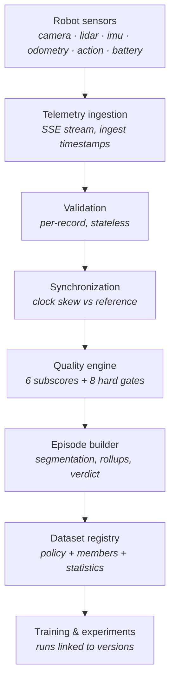

# ELA Lab

**Embodied Learning from Action — a robotics data quality & dataset pipeline.**

_From robot experience to training-ready data._

A proof-of-concept that takes multimodal robot telemetry and turns it into versioned,
quality-scored, training-ready episodes — and, just as importantly, throws away the ones that would
poison a model.

I built it independently, in my own time, after reading the public Robotics Data Engineer job
description at Omakase Robotics.

**▶ Live: [data-pipline.vercel.app](https://data-pipline.vercel.app)** — open *Live Simulator* and
press **Run 45-second demo**.

> **This is a personal project.** It is **not affiliated with, endorsed by, or produced for Omakase
> Robotics** in any official capacity. No proprietary data, APIs, logos, branding or confidential
> information is used. Every robot, site, episode and metric in this repository is synthetic and
> generated by code you can read here.

---

## If you only have a minute

| | |
| --- | --- |
| **Watch it work** | [data-pipline.vercel.app](https://data-pipline.vercel.app) → **Live Simulator** → **Run 45-second demo**. A clean episode degrades in real time — camera dropout, clock drift, LiDAR dropout, invalid values — and gets **rejected with reasons**. Nothing is faked: the browser runs the real pipeline on the real stream. |
| **The code that matters** | [`lib/pipeline/`](lib/pipeline) — eight modules, no framework imports, [107 tests](tests). Start with [`quality.ts`](lib/pipeline/quality.ts) (the accept/reject decision) or [`sync.ts`](lib/pipeline/sync.ts) (the hardest part). |
| **The two bugs worth reading about** | [Why I built this](#why-i-built-this), below. A synchronization method that provably *could not* detect clock drift, and a data-quality check that fired on 121 of 200 episodes. Finding those was the actual work. |
| **What I'm not claiming** | [Limitations](#limitations). Synthetic data, no ROS 2, no model trained, experiment metrics simulated and labelled as such in the UI itself. |
| **What I'd do with real robots** | [Productionization](#productionization) — layer by layer, POC vs production. |

**The one-line version:** a score alone is unsafe, because averaging hides catastrophic single
dimensions — an episode with a 1.4 s LiDAR hole still scores 94. So this system ranks episodes with
a weighted score *and* rejects them with hard gates, and every verdict carries the reason.

---

## Why I built this

I came across a Robotics Data Engineer role whose charter was turning robot experience into
high-quality training data for VLA models. I don't have years of robotics data-engineering
experience. So rather than write "I'm a fast learner" in a cover letter, I spent a few days
building a small version of the problem to find out what it actually involves.

It turned out to involve more than I expected, and the interesting parts were not the ones I
predicted. Two examples, both of which are in the code and the commit history:

**1. Nearest-neighbour timestamp matching cannot detect clock drift.** My first synchronization
implementation did the obvious thing: for each camera frame, find the nearest IMU sample and call
the difference "drift". It reported a healthy ~5 ms on episodes I had deliberately injected 150 ms
of drift into. The reason is that both streams are periodic — if the IMU clock is 30 ms ahead at
100 Hz, nearest-neighbour matching just pairs each frame with a sample three slots over and still
reports ≤5 ms. **Constant offset aliases away entirely.** The method can only see errors smaller
than half the faster stream's period, which is exactly the range nobody cares about.

The fix was to stop comparing sensors to each other and start comparing both to a shared clock.
Every event carries a capture timestamp (from the sensor) and an ingest timestamp (from the
collector). Their difference is the apparent latency, and a sensor whose clock runs δ ahead reports
an apparent latency δ too small. Comparing two sensors' apparent latency at the same moment cancels
the transport time they share and leaves the clock difference. That version sees drift as a ramp,
sees constant offset as an offset, and does not alias. It's in
[`lib/pipeline/sync.ts`](lib/pipeline/sync.ts), with the reasoning in the module comment and an
explicit anti-aliasing regression test in [`tests/sync.test.ts`](tests/sync.test.ts).

**2. Differentiating noisy odometry manufactures phantom motion.** I wrote a check for a real
labelling failure: the action stream says `STOP` but the base is still moving, which teaches a
policy exactly the wrong thing. It fired on **121 of 200 episodes**. Odometry carries ~4 mm of
position noise; dividing that by the 40 ms gap between consecutive 25 Hz samples produces ~0.18 m/s
of speed that isn't there — well above the 0.06 m/s threshold. Widening the measurement baseline to
half a second divides the same noise by 0.5 s instead, leaving ~0.016 m/s. Add a grace period for
the fact that a walking robot takes about a second to actually stop after a STOP command, and the
check went from 121 false positives to 6 true ones.

Neither of those is a robotics insight — they're ordinary signal-handling mistakes. But finding
them is the actual work, and that is what I wanted to demonstrate.

---

## Demo

### ▶ **[data-pipline.vercel.app](https://data-pipline.vercel.app)**

_Or run it locally in three commands — see [Running locally](#running-locally)._

Open **Live Simulator → Run 45-second demo**. A scripted fault sequence plays out in real time:

| t     | What happens                                                             |
| ----- | ------------------------------------------------------------------------ |
| 0 s   | Six streams ingesting cleanly, quality ~99                               |
| 11 s  | Camera drops out for 0.8 s → HIGH alert, still inside the 1 s gate       |
| 17 s  | IMU clock starts drifting at 5.5 ms/s → sync deviation climbs            |
| 28 s  | LiDAR drops out for 1.35 s → **breaks the dropout gate**                 |
| 36 s  | LiDAR emits negative / out-of-spec ranges → validity falls               |
| 40 s  | Publisher re-emits sequence IDs → duplicates appear                      |
| 45 s  | Episode closes → **REJECTED**, with the reasons, into the registry       |

The faults are injected into the generator exactly like randomly-chosen ones. Nothing in the
detection path is special-cased for the demo, and
[`tests/demo.test.ts`](tests/demo.test.ts) asserts the whole narrative so a tuning change can't
quietly turn it into a clean, boring episode.

---

## Architecture



The pipeline is framework-free TypeScript with no React, no Next.js and no I/O in it. That is
what lets **the same modules run in three places**:

1. the offline batch job that materialises the demo catalog (`npm run seed`),
2. the server-side generator feeding the live stream,
3. **the browser**, which consumes the live stream and runs validation → synchronization → quality
   scoring → episode assembly on every event as it lands.

The live dashboard is not a mock-up reading canned numbers. The server plays the robot and the
transport, computes nothing, and makes no quality judgements; every metric on that page is produced
in the browser by the same code the batch job calls.

```
lib/
  pipeline/          the actual system — no framework imports anywhere in here
    types.ts         discriminated-union telemetry envelopes
    config.ts        rates, weights, gates, thresholds (single source of truth)
    validate.ts      stage 3 — per-record validation
    sync.ts          stage 4 — clock skew measurement
    quality.ts       stage 5 — subscores, gates, the accept/reject decision
    episode.ts       stage 6 — segmentation, stream-level faults, assembly
    dataset.ts       stage 7 — versioning, policies, exclusion reports
    export.ts        JSON / JSONL / CSV manifests
  sim/               the robot: kinematics, sensor models, fault injection
  server/            read access to the materialised catalog
scripts/seed.ts      the batch job
tests/               107 tests over the pipeline
```

---

## Features

- **Live simulator** — a simulated robot streams camera, LiDAR, IMU, odometry, action and battery
  telemetry over Server-Sent Events at ~190 events/second, in real time.
- **Fault injection** — dropouts, packet loss, clock drift, late/out-of-order delivery, duplicate
  publishes, NaN/Infinity, negative LiDAR ranges, impossible accelerations, camera degradation,
  battery collapse, velocity-limit breaches, and action labels that contradict the odometry.
- **Data quality engine** — six weighted subscores, eight hard gates, and an anomaly veto, with a
  human-readable justification attached to every verdict.
- **Episode explorer** — 180 scored episodes with per-sensor availability, synchronization charts,
  action tracks, anomaly lists and re-validated raw event samples.
- **Dataset registry** — four versions across two datasets, each an immutable policy + member list +
  statistics + a per-episode exclusion report.
- **Interactive dataset builder** — set a policy, cut a version, see exactly which episodes were
  admitted and which rule excluded the rest, and download the manifest as JSON / JSONL / CSV.
- **Fleet view** — per-robot data health, where two robots' known hardware/firmware faults surface
  as data problems before they'd surface as operational ones.
- **Experiment tracking** — simulated runs, each linked to the dataset version it consumed.
- **Architecture page** — every stage documented as *what it does / why it exists / what would
  change in production*.

Scale of the committed catalog: **10 robots · 180 episodes · 1,132,508 telemetry events processed ·
269 anomalies · 112 training-ready / 30 flagged / 38 rejected · 4 dataset versions · 5 experiments.**

---

## Data model

Every event shares one envelope, discriminated on `sensor` so the validator narrows the payload
without casts:

```jsonc
{
  "robot_id": "robot-001",
  "episode_id": "episode-0042",
  "sensor": "imu",
  "sequence_id": 104823,
  "timestamp": 1750000012.432,        // capture time, on the SENSOR's clock
  "ingest_timestamp": 1750000012.464, // arrival time, on the COLLECTOR's clock
  "payload": { }
}
```

The two timestamps are the load-bearing part of the schema. `timestamp` cannot be trusted — it's
what the drifting sensor thinks the time is. `ingest_timestamp` comes from one shared clock, which
is what makes clock skew measurable at all.

| Sensor     | Payload                                                     | Production rate | Simulator rate |
| ---------- | ----------------------------------------------------------- | --------------- | -------------- |
| `camera`   | `frame_id, width, height, blur_score, exposure_score`        | 30 Hz           | 15 Hz          |
| `lidar`    | `points, range_min, range_max, invalid_points`               | 10 Hz           | 5 Hz           |
| `imu`      | `ax, ay, az, gx, gy, gz`                                     | 200 Hz          | 100 Hz         |
| `odometry` | `x, y, theta`                                                | 50 Hz           | 25 Hz          |
| `action`   | `action, linear_velocity, angular_velocity`                  | 10 Hz           | 5 Hz           |
| `battery`  | `percent, voltage, current, temperature_c`                   | 1 Hz            | 1 Hz           |

LiDAR is stored as summarised point-cloud metadata, not raw clouds — in production the cloud goes
to object storage and the episode row keeps a pointer. Camera frames are metadata only; no image
data exists anywhere in this project.

Streams run at half production rate so a browser can hold a live multimodal session. Completeness is
measured against the simulator rate, so the metric stays correct — but it does mean the
LiDAR↔camera pair resolves drift down to ~33 ms rather than ~17 ms.

---

## Quality engine

Two independent mechanisms, deliberately.

**A weighted score (0–100)** ranks episodes against each other:

| Dimension       | Weight | Measures                                             |
| --------------- | ------ | ---------------------------------------------------- |
| Completeness    | 30%    | received vs expected events, per sensor              |
| Synchronization | 25%    | p95 clock skew against the camera reference          |
| Validity        | 20%    | share of records passing schema + plausibility checks |
| Sensor health   | 15%    | per-sensor composite of the above plus dropouts      |
| Ordering        | 5%     | share of events arriving out of capture order        |
| Duplication     | 5%     | share of repeated sequence IDs                       |

**Eight hard gates** reject outright, regardless of score:

| Gate                     | Threshold        |
| ------------------------ | ---------------- |
| Overall completeness     | ≥ 85%            |
| Per-sensor completeness  | ≥ 75%            |
| Record validity          | ≥ 90%            |
| Sync deviation p95       | ≤ 50 ms          |
| Longest sensor dropout   | ≤ 1000 ms        |
| Duplicate events         | ≤ 5%             |
| Out-of-order events      | ≤ 10%            |
| Episode duration         | ≥ 5 s            |

The score alone is unsafe, and the gates are the reason. **Averaging hides catastrophic single
dimensions**: an episode with a 1.4 s LiDAR hole still scores 94, because five healthy dimensions
outvote one dead one. No amount of good IMU data makes a missing modality trainable. There's a test
for exactly that case.

Two smaller decisions worth calling out:

- **Out-of-order arrival is weighted gently and gated loosely** (5%, ≤10%) because it's *recoverable*
  — buffering to a watermark fixes it, at the cost of latency, not data. Missing data is not
  recoverable, so completeness carries 30%.
- **Any HIGH or CRITICAL anomaly blocks automatic inclusion**, even at a passing score. Those aren't
  "slightly worse data", they're specific defects a human should look at. This is what puts episodes
  in the `FLAGGED` band.

Verdicts: **GOOD ≥ 90 → `TRAINING_READY`** · **70–90 → `FLAGGED`** (human review) · **< 70 or any
gate failure → `REJECTED`**. Every rejection carries machine-readable `gate_failures` and
human-readable `reasons` — "rejected" with no explanation is not an answer a data engineer can act
on.

---

## Dataset versioning

A version is an immutable **(policy, member list, statistics)** triple. Two properties matter more
than anything else:

- **Reproducible** — the same episodes and the same policy always produce the same version, so a
  training run can be traced to exactly what it saw. Builds are a pure function, which is also why
  nothing needs to be persisted server-side.
- **Explainable** — every excluded episode carries the rule that excluded it. "110 candidates → 67
  included" is useless without the other 43.

The seeded registry tells a deliberate story in order: `v0.1` was permissive to get volume, the
data-quality ablation showed FLAGGED episodes hurt evaluation, `v0.2` removed them and raised the
floor to 85, `v0.3` raised it again to 88. Versions get stricter, not looser.

Manifests export as JSON (envelope + policy + statistics + episodes), JSONL (one episode per line,
for streaming training-time readers) or CSV.

---

## Running locally

```bash
npm install
npm run seed     # regenerate data/catalog.json (~5 s, deterministic)
npm run dev      # http://localhost:3000
```

```bash
npm test         # 107 tests over the pipeline
npm run typecheck
npm run lint
npm run build
```

`data/catalog.json` is committed, so `npm run seed` is only needed if you change the generator or
the thresholds. The whole app is self-contained: **no database, no API keys, no external services.**

### Deploying to Vercel

1. Push the repo to GitHub.
2. In Vercel, **Add New → Project** and import it.
3. Accept every default and click **Deploy**.

That's the whole process. Framework detection picks up Next.js, the build command is `next build`,
and **there are no environment variables to set** — `.env.example` documents a few that only affect
the offline seed job. There is no database, no API key and no external service, so nothing can be
misconfigured.

The reason it needs no configuration is that `data/catalog.json` is committed. The 180 episodes are
generated ahead of time by `npm run seed`, not at request time, so the deployed app does no
simulation work on a cold start — it reads a snapshot.

Two deployment details worth knowing:

- **The SSE route is capped at `maxDuration = 60`.** That's the ceiling every Vercel plan allows
  without Fluid Compute, so this deploys on a free Hobby account unchanged. Setting it higher than
  your plan permits fails the *build*, not just the request. The scripted demo is 45 s, so it always
  completes inside one connection; if you're on Fluid Compute or Pro you can raise it in
  `app/api/stream/route.ts` for longer continuous sessions.
- **When the stream is cut, the client recovers.** `EventSource` reconnects on its own and the
  dashboard shows `RECONNECTING` rather than silently freezing on stale numbers.

Node 20.9+ is required (pinned in `engines`); Vercel's default runtime already satisfies it.

---

## Productionization

None of the right-hand column is used in this POC. It's a plan, not a claim.

| Layer               | This POC                                   | Production                                        |
| ------------------- | ------------------------------------------ | ------------------------------------------------- |
| Streaming           | Server-Sent Events from a simulated robot  | Kafka / Google Pub/Sub, partitioned by `robot_id`  |
| Storage             | Committed JSON snapshot                    | GCS / S3 with Parquet + MCAP shards                |
| Warehouse           | In-process reads over that snapshot        | BigQuery or Snowflake                              |
| Orchestration       | A single seed script                       | Airflow or Dagster, one DAG per stage, backfillable |
| Dataset versioning  | Deterministic manifests, rebuilt on demand | lakeFS / DVC + a dataset registry table            |
| Experiment tracking | Simulated runs in the catalog              | MLflow / Weights & Biases, dataset version as a run param |
| Monitoring          | Live dashboard + alert panel               | Prometheus + Grafana, alerts routed to on-call     |
| Robot integration   | Synthetic telemetry generator              | ROS 2 bridge, MCAP recording, vendor robot SDKs    |
| Data formats        | Typed TypeScript envelopes                 | RLDS / LeRobot episode formats                     |

The pipeline modules are the part designed to survive that migration. They take an array of events
and return metrics — they don't know whether those events came from a generator, a Kafka consumer or
an MCAP file, and none of them import a framework.

---

## Limitations

Being specific about this matters more than the feature list:

- **All data is synthetic.** There is no physical robot, no real camera or LiDAR data, and no image
  or point-cloud bytes anywhere in the repo.
- **No ROS 2, no MCAP, no RLDS.** The envelope is my own design, informed by what those formats
  carry, not compatible with them.
- **No model was trained.** Every experiment metric is generated, and generated with a deliberate
  monotone relationship to dataset quality — that relationship is the *hypothesis* an ELA pipeline
  exists to test, not evidence produced here. The Experiments page says so on the page itself.
- **Storage is a committed JSON file**, not a warehouse. Datasets built in the browser exist for
  that session only and are labelled as such in the UI.
- **The synchronization method conflates clock skew with transport latency.** Both shift apparent
  latency. I partly disentangle them by reporting the median (persistent → skew) separately from the
  spread (noisy → jitter), but only PTP-disciplined clocks or a shared hardware trigger would remove
  the ambiguity properly.
- **Streams run at half production rate**, which halves the resolution of the LiDAR↔camera sync pair.
- **Quality thresholds are my judgement calls.** They're defensible and documented, but they were
  tuned against a generator I also wrote — the real ones would come from measuring which data
  actually improves a model.

---

## What I'd build next

1. **ROS 2 ingestion** — a bridge subscribing to real topics, replacing the generator while leaving
   every pipeline module untouched. This is the test of whether the abstraction is real.
2. **MCAP / RLDS output**, so episodes are consumable by actual VLA training code.
3. **Kafka or Pub/Sub** in place of SSE, with idempotent consumers keyed on `sequence_id` — the
   duplicate detection here is already the consumer-side half of that.
4. **Object storage + Parquet**, moving raw streams out of the metrics path entirely.
5. **Airflow/Dagster DAGs** with backfill, so a threshold change can be replayed over history.
6. **MLflow integration**, recording dataset version as a run parameter so lineage survives outside
   this app.
7. **Learned quality scoring** — replacing my hand-tuned weights with weights fitted against
   downstream model performance, which is the only defensible way to set them.

---

## Tech stack

Next.js 16 (App Router) · React 19 · TypeScript (strict, `noUncheckedIndexedAccess`) · Tailwind CSS v4 ·
Recharts · Lucide · Vitest · Server-Sent Events. No database, no external services.

Chart colours are a validated categorical palette — checked for lightness band, chroma floor,
colour-vision separation (worst adjacent ΔE 8.4) and 3:1 contrast against the surface. Series
identity is never carried by colour alone.

---

## Author

**Ibrahim** — AI/ML Engineer, Japan

- LinkedIn: https://www.linkedin.com/in/ibrahimonmars/
- GitHub: https://github.com/ibrahim-string

---

_An independent project built by Ibrahim, inspired by publicly available robotics data-engineering
challenges. Not affiliated with, endorsed by, or produced for Omakase Robotics._
